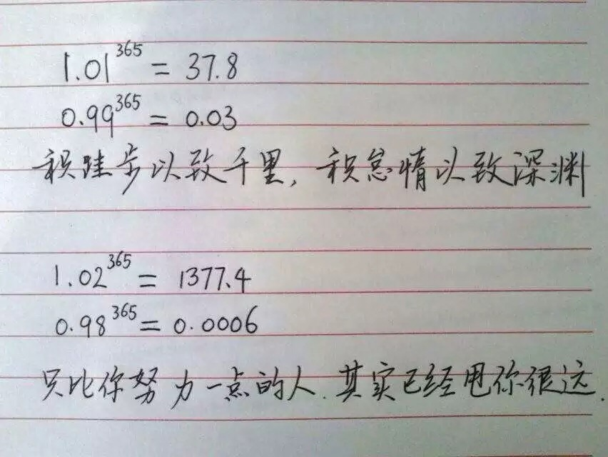

###通往财富自由之路
####通往财富自由之前的三条铁律
1. **成长才是根本关键；**
2. **重视价值，忽略估值；**
3. **耐心比什么都重要；**

　　关于1，一个不能忽略的事实是，这个世界在变得更好。世界变好的一个表现就是，真正有能力的人是不会被埋没的。在信息流动成本越来越低的时代里，能力被埋没的可能性也会趋近于零。 
　　关于选择，判断标准是：选择的事能不能让我积累更多的能力？你的每一个选择，都要从积累能力的角度出发，每一次选择，都要考虑自己还需要什么能力，以及新的选择对于自己发展已经有的能力有没有帮助。**在这个选择之后，能帮我完善那个已有能力，能让我获得什么新能力。** 
　　关于2，桥水资本的老大达里奥是这样建议的：**不要让自己的估值过分超过自己的实际价值。** 
　　关于3，耐心的力量，相当于交易当中的**复利效应**，并且一定会通过复利效应展现出来。可能许多人达不到财富自由的里程碑，几乎都是拜没有耐心所赐。每个人都不是生来就在某个领域掌握了极好的条件，这不该是你没有耐心的理由，否则无异于成为被外界条件操控的傀儡，而你的上限，就只有手里握有的筹码了。更明智的做法是，**用心智的力量去时刻告诉自己，觉得困难的阶段不过是必经之路----而这正是耐心的真谛。** 
　　
　　这里面并没有什么秘密，全世界的人都能知道，只不过，大多数人仅仅是知道而已，只有极少数人执拗地，彻底地，不折不扣地执行了这些原则................. 